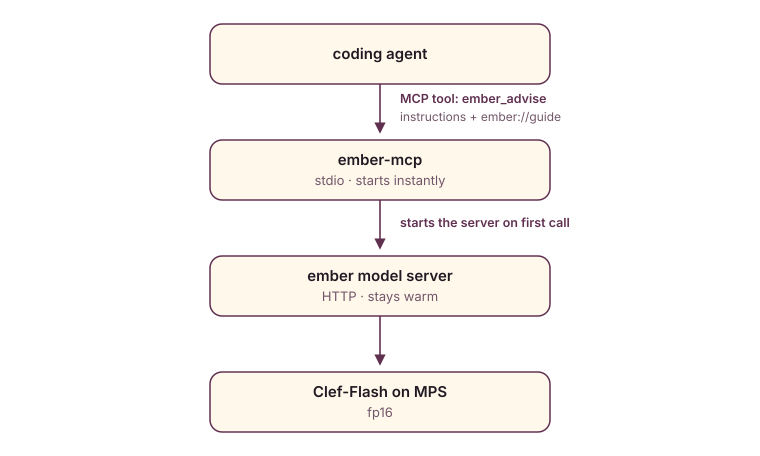

<picture>
  <source media="(prefers-color-scheme: dark)" srcset="assets/brand/hero-dark.svg">
  
</picture>

<!-- mcp-name: io.github.shapeandshare/ember -->

**A local gut feeling for coding agents.** ember runs a decision model — Cloudflare's
Clef-Flash, from its [public Hugging Face repo](https://huggingface.co/Cloudflare/clef-flash)
— on your Apple Silicon Mac and gives agents one MCP tool, `advise`: describe a situation,
ask typed questions, and get back a calibrated feeling about every option. It's a little
buddy for judgment calls — it advises; the agent decides.

**Website:** [shapeandshare.github.io/ember](https://shapeandshare.github.io/ember/)

## How it works

A decision model is not a chat model: it takes a `state` plus a schema of typed
questions and returns one probability per option, with no text generation. So ember
plugs into agents as a **tool**, while their reasoning stays on their normal LLM:

<picture>
  <source media="(prefers-color-scheme: dark)" srcset="assets/diagrams/call-path-dark.svg">
  
</picture>

- The **model server** (`ember/serving/server.py`) loads the model once and stays warm across
  agent sessions.
- The **MCP server** (`ember/mcp/mcp_server.py`) never loads the model; it starts the model
  server on the first tool call, so the MCP handshake stays instant.

### Names

| Thing | Name |
| --- | --- |
| Product, Python import, repository | `ember` |
| Distribution (`uv tool install`, PyPI) | `ember-advise`, because `ember` is taken on PyPI and `gut` is held by an empty project |
| CLI | `ember` (short alias: `gut`; `ember-advise` too, so `uvx ember-advise mcp` works) |
| MCP server / command | `ember` / `ember-mcp` |
| Tool | `advise` — opencode: `ember_advise`; Claude Code: `mcp__ember__advise` (plugin: `mcp__plugin_ember_ember__advise`); Kilo Code: `ember_advise` |
| Playbook skill / MCP resource | `ember-advise` / `ember://guide` |
| Environment variables | `EMBER_*` |

"Clef" always refers to Cloudflare's upstream model, never to this product. Select a model
with `ember model pull <name>` / `EMBER_MODEL=<name>`; run `ember model list` to see every
registered entry (`flash`, `full`).

A hosted deployment (e.g. [Outerbounds](https://outerbounds.com)) that supplies the model's
S3 location directly at start time doesn't use this registry at all — see "Hosted deployment:
a model location supplied at start time" below.

## Verified

On a MacBook Pro **M4 Max / 128 GB**, torch 2.14.1, transformers 5.18.0, mcp 2.3:

| Step | Result |
| --- | --- |
| Model load | ~5 s |
| Warm request | **~0.9–1.3 s** for ~220–360 input tokens |
| opencode end to end | ✅ the agent reads the instructions, lists the skill, and calls the tool unprompted |

## Install (Apple Silicon)

### Requirements

- **Apple Silicon Mac** (M-series) on macOS for local use (MPS). Intel Macs remain out of
  scope. For a hosted deployment on NVIDIA/CUDA compute (e.g. Outerbounds), see "Hosted
  deployment" below and `deployment/README.md`.
- **Unified memory** above the model's size: 32 GB or more for `flash` (9B), 64 GB or more
  for `full` (27B). Only 128 GB has been verified.
- **Disk**: about 18 GiB for `flash` or 55 GiB for `full`, in Hugging Face's shared cache
  (`~/.cache/huggingface`). Config, state, and logs live in
  `~/Library/Application Support/ember`.
- **Python 3.12**, managed by uv.

```bash
uv tool install --python 3.12 ember-advise

ember model pull                   # ~18 GB, resumable, disk-space checked
ember doctor                       # platform, dependencies, model, server, and agent registration
ember init --opencode --global     # register with opencode for every repo on this machine
```

Keep `--python 3.12`: uv otherwise picks your newest interpreter, which the pinned
torch/transformers stack is not tested on.

This installs the latest released wheel from PyPI.

To pin a specific release tag from GitHub instead (no PyPI required):

```bash
uv tool install --python 3.12 "ember-advise @ git+https://github.com/shapeandshare/ember@v0.9.0"
```

The repository is public, so the git install needs no credentials. To use SSH instead,
install from `git+ssh://git@github.com/shapeandshare/ember@v0.9.0`.

Installed ember before the rename, as `gut`? Run `uv tool uninstall gut` first: both
distributions provide the same commands.

Restart opencode and every repo on this machine gains `ember_advise`. The model server
stays **lazy** — it starts on the first tool call (or with `ember start`).

**Per-project skill and policy** (run once in each repo you want ember-aware agents):

```bash
cd /path/to/your/repo
ember agents install --agent opencode  # installs the ember-advise playbook skill
ember agents show snippet >> AGENTS.md # then edit the project policy block at the end
```

The skill teaches the agent *when* to consult ember and *how* to ask; the AGENTS.md snippet
adds a project-specific policy you customize (e.g. "check change risk before every push").
See [Agent onboarding](#agent-onboarding) below for all harnesses and options.

`flash` targets the commit verified on MPS (`17f0b0a`) and `full` its release commit
(`2f3de3d`, not yet verified locally) as a download convenience, and torch/torchvision are
pinned to the tested minor series — but ember does not restrict itself to a hand-maintained
allowlist of individually verified weights; it runs any model that fits its loader contract
(constitution Article V, "Model Loading"). Set `EMBER_MODEL_DIR` to run another weights
directory.

### Cloud

ember is Apple-Silicon-first locally, and supports NVIDIA GPUs for hosted deployment
(constitution Article VI, "Apple Silicon and CUDA") — three devices total: run it on an
Apple Silicon host with the memory above (MPS), on an NVIDIA GPU host (`EMBER_DEVICE=cuda`,
float16 — see "Hosted deployment: a model location supplied at start time" and
`deployment/README.md` for a full Outerbounds example), or on any host with the CPU fallback
(`EMBER_DEVICE=cpu` — float32, roughly twice the memory, much slower). The HTTP server binds
to loopback by default; to serve other machines set `EMBER_HOST` and set
`EMBER_SERVER_AUTH_TOKEN` to require `Authorization: Bearer <token>` (or any header name via
`EMBER_AUTH_HEADER`, e.g. `x-api-key`, on the client side). Ember does not terminate TLS —
front a remote-serving
deployment with a proxy. Clients point at it with `EMBER_SERVER_URL`. See
[COMPATIBILITY.md](COMPATIBILITY.md) and [SECURITY.md](SECURITY.md).

## Agent onboarding

Installing the tool is half the job; the other half is making agents **want** to consult it
at the right moments and read its answers sensibly. `ember/agent_kit/` ships that
guidance through every channel each agent actually reads:

| Channel | opencode | Kilo Code | Claude Code | Codex CLI | How you get it |
| --- | --- | --- | --- | --- | --- |
| MCP server instructions (when to consult, how to ask, how to read answers) | ✅ in the system prompt | ✅ in the system prompt | ✅ (2 KB cap) | — | built in, nothing to do |
| `ember://guide` resource (full playbook) | ✅ via `read_mcp_resource` | ✅ via `read_mcp_resource` | ✅ | — | built in |
| `ember-advise` skill (playbook, loaded on demand) | ✅ | ✅ | ✅ | ✅ | `ember agents install --agent <agent>` |
| AGENTS.md / CLAUDE.md policy block | ✅ | ✅ | ✅ (CLAUDE.md) | ✅ | `ember agents show snippet >> AGENTS.md` |

```bash
ember init --opencode                  # opencode: config entry, plugin, and skill
ember init --kilocode                  # Kilo Code: kilo.json entry and skill
ember init --codex                     # Codex CLI: .codex/config.toml entry and skill
ember agents install --agent claude    # .claude/skills/ember-advise/SKILL.md
ember agents install --agent codex     # .agents/skills/... (opencode reads this too)
ember agents show snippet >> AGENTS.md # then edit the project policy at the end
```

The skill is a playbook, not a reference card: the decision points worth consulting
ember about, copy-paste question sets for intent and readiness, failure triage, change
risk, routing, and effort, and starting confidence thresholds calibrated from observed model
output (re-measured whenever the pinned model revision changes). The snippet ends with a
**project policy** — edit it to wire ember into your own workflow, e.g. "check change
risk before every push".

Agent-specific notes:

- opencode reads skills from `.opencode/skills`, `.claude/skills`, and `.agents/skills`, so
  install one copy per project to avoid duplicate listings.
- Kilo Code: `ember init --kilocode` writes the `mcp.ember` entry to `kilo.json` (same
  config shape as opencode) and installs the skill to `.kilo/skills/ember-advise/SKILL.md`;
  the tool appears as `ember_advise`. Kilo Code also reads `AGENTS.md` automatically.
- Claude Code: register the server with `claude mcp add --scope user ember -- ember-mcp`
  (every project; drop `--scope user` to register it for the current project only); the
  tool appears as `mcp__ember__advise`. Or install the **ember plugin**, which bundles the
  MCP entry and the `ember-advise` skill (so skip `ember agents install --agent claude`):

  ```bash
  claude plugin marketplace add shapeandshare/ember
  claude plugin install ember@ember
  ```

  The plugin still runs the `ember-mcp` you installed with `uv tool install`, and its tool
  appears as `mcp__plugin_ember_ember__advise`. Use one route, not both, or the tool is
  listed twice.
- Codex CLI: `ember init --codex` writes `[mcp_servers.ember]` to `.codex/config.toml`
  (`--global`: `~/.codex/config.toml`, or `$CODEX_HOME/config.toml`) and installs the skill
  to `.agents/skills/ember-advise/SKILL.md`. Codex loads a project `.codex/config.toml` only
  for a trusted project, and `ember init --codex` tells you whether this one is. The entry
  forwards `EMBER_AUTH_TOKEN` by name (`env_vars`), never by value. Support for MCP server
  instructions and resources is unconfirmed, so rely on the skill and the AGENTS.md snippet
  there.

### Check what's registered

`ember doctor` closes with two lines per harness: its binary on `PATH`, and where ember is
registered for it — in this directory and globally — or the command that registers it. It
only reads each harness's config files; it never runs a harness CLI.

| Harness | Register | Project scope | Global scope | doctor also flags |
| --- | --- | --- | --- | --- |
| opencode | `ember init --opencode [--global]` | `opencode.json`, `.opencode/plugins/ember.js` | `~/.config/opencode/opencode.json`, `~/.config/opencode/plugins/ember.js` | a leftover `mcp.vault` entry from older `ember init` versions |
| Kilo Code | `ember init --kilocode [--global]` | `kilo.json` | `~/.config/kilo/kilo.json` | — |
| Codex CLI | `ember init --codex [--global]` | `.codex/config.toml` | `~/.codex/config.toml` | a project file Codex ignores because the project isn't trusted |
| Claude Code | `claude mcp add --scope user ember -- ember-mcp`, or the `ember@ember` plugin | `.mcp.json` (`--scope project`); `~/.claude.json` per project (`--scope local`); `enabledPlugins` in `.claude/settings.json` / `settings.local.json` | `~/.claude.json`; `enabledPlugins` in `~/.claude/settings.json` | a project `.mcp.json`, which Claude Code asks you to approve |

Each harness has its own check too: `opencode mcp list`, `codex mcp list`, `claude mcp list`.
Older `ember init` versions also added this repository's `vault` MCP server to every config
they wrote; if you ran `ember init --global`, doctor points at the leftover entry in your
global opencode config so you can delete it.

`ember init` records the `ember-mcp` it finds on your `PATH`, falling back to the Python
that runs it, so run `ember init --global` from the installed tool (`uv tool install …`)
rather than a checkout's `.venv`. It merges into existing configs and refuses to rewrite one
it can't parse (an `opencode.json` with comments, say), leaving that file untouched.

## CLI

`gut` is a short alias for every command below.

```bash
# lifecycle
ember doctor                      # platform, dependencies, model, server, agent registration
ember serve                       # run the model server in the foreground
ember start | stop | restart | status | logs
ember config path | show
ember uninstall [--purge-models]  # also removes global opencode/Kilo Code/Codex and skill installs

# models
ember model pull [flash|full]      # flash = 9B (default)
ember model list | path [name] | rm [name]

# opencode, Kilo Code, Codex CLI, and agents
ember init [--opencode] [--kilocode] [--codex] [--global] [--server-url URL] [--auth-header NAME]
ember agents install [--agent opencode|claude|codex|kilocode] [--global]
ember agents show instructions|skill|snippet
ember mcp                         # the MCP stdio server agents launch
```

## Usage

Ask the agent in natural language — "Is this bug report urgent, and which team should own
it?" — and it calls `ember_advise` with a state and typed questions:

```json
{
  "model": "clef-flash",
  "answers": {
    "urgent": { "type": "noul", "noul": 0.967 },
    "team": {
      "type": "choice",
      "choice": "db",
      "confidence": 0.9782,
      "probabilities": { "db": 0.9782, "frontend": 0.0218 }
    }
  },
  "usage": { "input_tokens": 220, "output_tokens": 0 },
  "latency_ms": 930.9
}
```

Question types: `noul` (yes/no → P(true)), `choice` (named options), `score` (ordered options →
expected score plus legend). The `model` field echoes the upstream model label.

When the evidence is visual, attach images or video frames inline: `images` is a list of
`data:image/png;base64,...` URIs (or `{"content_type": "image/png", "base64": "..."}`
objects), and `videos` is a list of videos, each a list of frame refs. Remote URLs and local
paths are rejected — the model server never reads host files or fetches URLs for an agent.

## Configuration

Settings resolve as **CLI flag > environment variable > config file > default**. The config file
is JSON at `ember config path` (keys `model`, `host`, `port`, `device`, `max_length`,
`server_url`, `auth_token`, `auth_header`, `allow_insecure_transport`, `request_timeout`,
`server_auth_token`, `max_request_length`; a `max_length` of `0` means the model's own
maximum, and an unset `max_request_length` means the loaded model's measured default).

| Variable | Default | Purpose |
| --- | --- | --- |
| `EMBER_HOST` / `EMBER_PORT` | `127.0.0.1` / `8765` | Local model server bind address |
| `EMBER_DEVICE` | `auto` | `auto`, `mps`, `cuda`, or `cpu` |
| `EMBER_MODEL` | `flash` | `flash` (9B, default) or `full` (27B), both from Cloudflare's public Hugging Face repos |
| `EMBER_MODEL_DIR` | — | Run weights from this directory instead of the pinned cache |
| `EMBER_MAX_LENGTH` | `0` (the model's maximum: 262,144) | The most tokens the model processes; `0` derives it from the model's `config.json`, and a larger value is clamped to it |
| `EMBER_MAX_REQUEST_LENGTH` | unset: the model's measured default (32,768 for `flash` and `full` until measured) | Per-request cap on the whole encoded request (state, media, questions, schema, prompt wrapper), checked before inference. A request over it is refused with a 413 that states its token split, never truncated. `0` disables the cap; the maximum still applies |
| `EMBER_SERVER_URL` | `http://127.0.0.1:8765` | Inference endpoint the client sends to; loopback by default, may be remote |
| `EMBER_AUTH_TOKEN` | — | Client credential for a remote endpoint |
| `EMBER_AUTH_HEADER` | `Authorization` | Header carrying the credential; `Authorization` sends `Bearer <token>`, any other name sends the token verbatim |
| `EMBER_ALLOW_INSECURE_TRANSPORT` | `0` | Allow plaintext `http` to a non-loopback endpoint (off by default) |
| `EMBER_REQUEST_TIMEOUT` | `300` | Seconds bounding a remote request |
| `EMBER_SERVER_AUTH_TOKEN` | — | When set, the server requires `Authorization: Bearer <token>` on `/v1/systemone` |
| `EMBER_AUTOSTART` | `1` | Let the MCP server start a local server on demand (loopback only) |
| `EMBER_START_TIMEOUT` | `300` | Seconds to wait for the model server to start |
| `EMBER_STATE_DIR` | Application Support | Where the pid file and logs live |
| `EMBER_MODEL_S3_URI` | — | An `s3://bucket/prefix` URI naming the exact model location to load — for a deployment (e.g. Outerbounds) that supplies the model's S3 location at start time instead of a `REGISTRY` key. See "Hosted deployment: a model location supplied at start time" below. |
| `EMBER_S3_ACCESS_KEY_ID` / `EMBER_S3_SECRET_ACCESS_KEY` | — | AWS credentials for `EMBER_MODEL_S3_URI`. **Optional** — when unset, boto3's own default credential chain applies (an IAM role attached to the compute, e.g. Outerbounds; env vars; `~/.aws/credentials`). Set explicitly only where no role is attached (e.g. a local developer machine) |
| `EMBER_S3_REGION` | — | AWS region passed to the S3 client |

`ember doctor` and `GET /health` (`engine`) report the limits in force and where each came
from: the model, a fallback, an operator setting, or a measured default.

### Hosted deployment: a model location supplied at start time

Some deployments (e.g. an [Outerbounds](https://outerbounds.com) app) supply the model's S3
location directly at start time, rather than selecting a `REGISTRY` entry. Set:

```sh
export EMBER_MODEL_S3_URI=s3://my-bucket/clef-flash
export EMBER_DEVICE=cuda   # Outerbounds compute is Linux — no MPS; cuda is the GPU path
ember serve                # foreground, container-friendly (not `ember start`)
```

No AWS credentials need to be set explicitly when the compute already has an IAM role
attached (the expected case on Outerbounds) — boto3's default credential chain picks it up automatically. Set
`EMBER_S3_ACCESS_KEY_ID`/`_SECRET_ACCESS_KEY` explicitly only where no role is
attached.

This is checked once at startup, before the server begins serving, and takes priority over
`EMBER_MODEL`/the `model` config key entirely — there is no `REGISTRY` lookup for this path.
ember supports any model that can run under its loader contract (constitution Article V,
"Model Loading"); it is not a hand-maintained allowlist of individually hash-verified weights,
so a URI-supplied location loads directly, with no pin or hash to check against.

A complete Outerbounds deployment example — `deploy.yaml`, a generated `requirements.txt`,
and a `make deployment-requirements` target — lives in [`deployment/`](deployment/README.md).

### Remote inference

Local inference is the default. To serve another machine — for example, a second Mac that
lacks the memory for the model — run the server on the host and point the client at it.

#### On the host machine (the one with the model)

```bash
# Bind to all interfaces so other machines can reach it
EMBER_HOST=0.0.0.0 ember start

# Recommended: also require a bearer token so only your client can use it
EMBER_HOST=0.0.0.0 EMBER_SERVER_AUTH_TOKEN=your-secret ember start
```

Ember does not terminate TLS. On a trusted LAN, plain HTTP is fine (see the client note
below). Over the internet, put a TLS proxy (nginx, Caddy) in front and use `https://`.

#### On the client machine (the one running the agent)

```bash
export EMBER_SERVER_URL="http://<host-ip>:8765"   # use https:// if behind a TLS proxy
export EMBER_AUTH_TOKEN="your-secret"             # matches EMBER_SERVER_AUTH_TOKEN on the host
export EMBER_AUTOSTART=0                          # nothing local to start
ember status                                      # reports remote endpoint + reachability
```

Plain `http` to a non-loopback host is refused by default; set
`EMBER_ALLOW_INSECURE_TRANSPORT=1` to allow it on a trusted LAN. Credentials may also be
sent as a custom header (`EMBER_AUTH_HEADER=X-API-KEY`). `ember status` / `ember doctor`
report the endpoint kind, reachability, the remote's advertised `auth_required`, and whether
a credential is configured; reverting to local is a single change (unset these variables).

#### Bootstrapping a client against a hosted endpoint

`ember init` can generate the `mcp.ember` entry for a remote endpoint directly, instead of
hand-editing the generated `opencode.json` / `kilo.json` / `.codex/config.toml`:

```bash
ember init --opencode --kilocode \
  --server-url https://decisions.example.com \
  --auth-header X-API-KEY        # omit for the default Authorization: Bearer header
```

This writes `EMBER_SERVER_URL` (and `EMBER_AUTH_HEADER`, if given) into the config file and
forces `EMBER_AUTOSTART=0` — there is nothing local to autostart. **The credential itself is
never written to the file**: export `EMBER_AUTH_TOKEN` in the shell that launches the agent
(or your GUI app's environment) instead, so a secret never lands in a config file that might
be project-committed. Without `--server-url`, `ember init` behaves exactly as before (a local
loopback entry).

## Metrics

While the model server is running it exposes Prometheus metrics at
`http://127.0.0.1:8765/metrics` (the `EMBER_HOST`/`EMBER_PORT` address):

| Metric | Type | Meaning |
| --- | --- | --- |
| `ember_advise_requests_total{status}` | counter | advise requests by HTTP status (`200`, `413`, `422`, `503`, `500`) |
| `ember_advise_latency_seconds` | histogram | advise request latency by status |
| `ember_advise_input_tokens_total` | counter | input tokens processed |
| `ember_advise_output_tokens_total` | counter | output tokens produced |
| `ember_model_info{model,device,dtype}` | gauge | `1` while a model is loaded |

The endpoint binds to the same address as the rest of the API (loopback by default), so
it is reachable only there unless you change `EMBER_HOST`. Ember's metrics live in a
dedicated Prometheus registry, so the standard `python_*`/`process_*` collectors are not
included — `/metrics` shows only the table above.

## Development

```
ember/
  cli.py              # the `ember` command (alias `gut`): argparse wiring + main()
  commands/           # subcommand handlers: lifecycle, doctor, models, agents, eval, config
  models.py           # pinned model registry + pull/list/rm
  serving/            # HTTP model server, MPS runtime, lifecycle, media
    server.py         #   FastAPI: POST /v1/systemone, GET /health (reports pid)
    runtime.py        #   MPS-safe loader (CPU load → .to("mps")) + Engine
    process.py        #   model-server lifecycle (pid file + HTTP health)
    media.py          #   base64 data-URI / {content_type,base64} → PIL decoder
  mcp/                # MCP stdio server and wire types
    mcp_server.py     #   MCP stdio server: advise tool, instructions, ember://guide
    mcp_types.py      #   Pydantic wire types (Question, AdviseInput)
  cfg/                # configuration, endpoint, and platform paths
    config.py         #   config resolution (CLI flag > env > file > default)
    endpoint.py       #   client endpoint: loopback check, transport guard, auth headers
    paths.py          #   platform-aware app dirs (macOS Library, XDG)
    repo_root.py      #   checkout / main-worktree root from .git on disk
  opencode/           # opencode integration
    opencode_config.py  # generates opencode.json
    opencode_plugin.py  # installs the npm plugin
  kilocode/           # Kilo Code integration: generates kilo.json
  codex/              # Codex CLI integration: .codex/config.toml entry, project trust
  claude/             # Claude Code registration detection (read-only)
  agent_kit/          # what agents read: instructions, ember-advise skill, AGENTS snippet
    api.py            #   public API: instructions(), skill(), snippet(), install_skill()
packages/opencode-plugin/   # opencode plugin source (unpublished; `ember init --opencode` writes the installed copy)
packages/claude-plugin/     # Claude Code plugin (MCP entry + mirrored ember-advise skill), listed by .claude-plugin/marketplace.json
server.json                 # MCP Registry entry (io.github.shapeandshare/ember), published by release-ember.yml
scripts/              # make-only dev tools: MPS smoke, MCP e2e, site build, provenance/vault audits
evals/eval/           # benchmark harness: run, report, export, snapshot, agent-in-the-loop
tests/                # pytest suite (unit + model-backed, host-isolated)
vault/                # project memory (Obsidian): decisions, discoveries, session logs
.specify/             # spec-kit; memory/constitution.md governs this repo
AGENTS.md CLAUDE.md   # guidelines for agents working on this repo
Makefile              # contributor lifecycle (wraps the CLI)
```

```bash
make bootstrap    # deps + pinned weights + opencode.json + doctor (idempotent)
make start        # model server in the background; stop | restart | status | logs
make opencode     # this checkout's opencode plugin and skill
```

`opencode.json`, `.opencode/plugins/ember.js`, and `.opencode/skills/ember-advise/` (like
`kilo.json`, `.codex/config.toml`, and the other harnesses' `ember-advise` skill copies)
embed this clone's absolute paths or copy packaged files, so they are gitignored — regenerate
them with `make init` / `make opencode` after cloning. `.opencode/opencode.json` is shared and
committed: it registers the `vault` MCP server that agents use to read and write `vault/`
(launch opencode from the repository root).

### Make targets

| Target | What it does |
| --- | --- |
| `make help` | List all targets (default) |
| `make bootstrap` | From a fresh clone: `setup` + `download` + `init` + `doctor` |
| `make setup` / `sync` / `download` | Deps only / deps only (alias) / pinned weights to `.models/` |
| `make init` / `make opencode` | `ember init` / `ember init --opencode` for this checkout |
| `make serve` / `start` / `stop` / `restart` / `status` / `logs` | Model-server lifecycle via the CLI |
| `make mcp` / `make mcp-list` | Run the MCP server / `opencode mcp list` |
| `make test` / `test-fast` / `test-strict` | Full suite / unit tests only / full suite that fails without weights |
| `make test-evals` | Calibration eval suite: positive + negative recipe cases (loads model) |
| `make eval-run` | Run the benchmark dataset against the live server; writes `results/` |
| `make eval-snapshot` | Copy the latest run into `benchmark/` for the site to render |
| `make eval-context` | Long-context probe: measure each model's request cap on MPS (hours) |
| `make eval-context-smoke` | Long-context probe smoke: flash, 2K and 4K, 3 items (minutes) |
| `make eval-report` | Render the most recent run as a Markdown table |
| `make mcp-check` / `make smoke` | MCP end-to-end check / direct MPS inference |
| `make compile` / `make check` | Byte-compile / compile + unit tests |
| `make ci` | `bootstrap` + `check` + `test-strict` |
| `make doctor` | `ember doctor` |
| `make vault-audit` | Check `vault/` notes: frontmatter, tags, wikilinks, code-refs, orphans |
| `make site` / `make site-serve` | Build the Pages site into `site/_site` / preview it at `:4000`, rebuilt and reloaded in the browser on every edit (needs Docker) |
| `make release-dry` | Preview the next ember version bump without changes |
| `make release-ember` | Trigger the release workflow on `main` (bump PR → GitHub Release → PyPI) |
| `make clean` / `make clean-model` | Caches and build output / weights (`EMBER_FORCE=1` skips the prompt) |

Make re-syncs the environment automatically when `pyproject.toml` or `uv.lock` changes.

## Tests

```bash
make test         # full suite (~30 s, loads the model once)
make test-fast    # unit tests only, no model load (~12 s)
make check        # compile + test-fast
make test-strict  # full suite; fails (not skips) if weights are missing
make ci           # bootstrap + check + test-strict
```

`tests/` covers the supported call paths:

- `GET /health` and `POST /v1/systemone` across `noul` / `choice` / `score`, probability
  normalization, and request-validation `422`s
- MCP tool discovery, `advise` over stdio, actionable errors (server down, model missing,
  malformed questions), and autostart on a configured port with pid cleanup
- the agent kit: instructions size, skill frontmatter, the `ember://guide` resource
- the CLI: `agents`, `init --opencode`, `status`/`stop` on unused ports, `doctor`, `uninstall`
- process safety: `stop` never signals a pid that is not an ember server it started

**Safe on a host running other opencode instances.** The suite binds random free ports (never
`8765`), keeps state in temporary directories, stops only the processes it started, and never
invokes the opencode CLI or touches global opencode config.

**CI** (`.github/workflows/ci.yml`) runs `uv sync --locked` and then, as separate jobs, format
and lint, `mypy --strict`, bandit, `make check`, `uv build` plus an install smoke of the built
wheel on a hosted Apple Silicon runner, a SonarCloud scan (needs the `SONAR_TOKEN` repository
secret), and a [zizmor](https://docs.zizmor.sh) audit of the workflows. Model-backed tests are
**not** run in CI: the ~19 GB fp16 model does not fit the available runners (hosted or the
org's 8 GiB self-hosted VMs), so run `make test` locally for model-affecting changes.

**Coverage is tracked and gated** (constitution Article XI). Run `make test-cov` to see the
full report. The enforced floor (`fail_under` in `pyproject.toml`) is the current measured
level and may only increase — currently **81 %**. Lowering it requires explicit, recorded
approval per Article XI §11.2.

### Benchmark

`evals/clef-flash.jsonl` is a 475-item benchmark covering the five agent-kit recipes (intent
and readiness, failure triage, change risk, routing, effort and approach) plus four vision
recipes (`vision_noul`, `vision_choice`, `vision_score`, `vision_video`): 843 scored questions
(351 `choice`, 292 `noul`, 168 `score`, 32 across the four vision recipes), split into
`dev` (236 items) and `test` (239). Vision items carry an `images` or `videos` field
(base64 `data:` URIs) alongside `state` and `questions`. Each line is
self-contained (`state`, the recipe's fixed question set, a gold label for every question, and
a `rationale`), so other implementations can score it without this harness.

```bash
make eval-run       # or: ember eval run [--split dev|test] [--category <recipe>]
make eval-report    # Markdown report of the most recent run
make eval-export    # or: ember eval export; the reviewer bundle described below
ember eval report --compare results/<a>_results.json results/<b>_results.json
```

`ember eval export` writes `results/<run_id>_report/` for external reviewers:
`report.html` (one self-contained file with inline charts, light and dark themes, a print
layout, and item filters; it loads nothing from the network), `report.md` with its
`figures/*.svg`, and `data/` with the run's results, trace, and the exact dataset scored.
The report covers context, the system under test, benchmark design, metric definitions with
references, results, calibration, the agent kit's decision rules replayed on every item, a
review card for every miss, limitations, and reproduction pins.

The report gives accuracy with a 95% bootstrap interval, macro-F1, top-label ECE, and Brier
score (`choice`, `noul`); ranked probability score and MAE (`score`); and coverage and accuracy
at the agent kit's act-on-it thresholds. Each run records the git hash, the engine, and the
dataset's SHA-256, and `--compare` warns when two runs scored different item sets.

Gold labels are judged from `state` alone against the recipe's option descriptions, and they
are fixed before any run: `needs_review` is true exactly when `risk` is Medium or High, and
`retry` only for `flaky` failures. A person reviews disagreements; labels are never changed to
match the model. `make check` validates the dataset (`tests/test_eval_benchmark.py`).
`ember eval` reads `evals/` and `scripts/` from the checkout, so it works only in a clone.

### Long-context probe

`make eval-context` (or `ember eval context`) measures how each registered model holds up
as requests grow: it pads every text-only benchmark item with public-domain filler to
2K–64K tokens, with the evidence at the start, middle, or end, and records accuracy,
calibration, peak MPS memory, and latency. A pre-declared rule then picks each model's
default cap: the longest length where accuracy stays within 2 points and Brier within
0.02 of the 2K result at every depth, and peak memory fits 32 GB (flash) or 64 GB (full).
It runs in-process on MPS for hours, never touches a running server, and writes
`results/context/<run_id>/`; the run a decision cites is copied into
`evals/context/runs/` with `--snapshot`. `--rescore` rebuilds the summary byte for byte,
and `--reproduce` re-runs a run's pinned inputs and compares them.

### Agent in the loop

The benchmark above scores the model. `ember eval agent` scores ember the way it is used:
through a coding agent. It gives opencode 54 scripted requests (vague and precise asks,
failing tests, risky and trivial commits, routing and effort questions, and controls), each
in a throwaway git repo, and judges the agent only by what it did (files, commits, tests,
its reply). Each scenario runs under four conditions: `none` (no ember), `mcp` (the MCP
server and its instructions), `skill` (plus the `ember-advise` skill), and `full` (plus the
AGENTS.md policy).

```bash
ember start                       # the agent sessions call the warm server
make eval-agent-smoke             # 6 scenarios x 4 conditions x 2 models, 1 trial
make eval-agent                   # or: ember eval agent [--models ...] [--trials 3] [--parallel 8]
ember eval export --agent latest  # put the agent results first in the reviewer report
```

Every session runs `opencode run --pure` with a private HOME and XDG directories and no TCP
port, so your opencode config, plugins, sessions, and running instances are untouched. The
provider key is read from the environment or opencode's auth file and passed only to the child
process. The run reports, per model and condition: gold-action accuracy, its paired change
against `none`, how often the agent consulted ember at decision points (and on controls),
whether it consulted before acting, asked the kit's recipe questions, passed the evidence, and
followed ember's answer, plus cost and time per session. It spends real provider credit and is
never part of `make check`, `make test`, or CI.

## Caveats

- **Gated DeltaNet fallback.** Qwen3.5's backbone is a hybrid linear-attention model. The
  optimized CUDA kernels (`causal_conv1d`, `flash-linear-attention`) don't exist for Apple
  Silicon, so it uses the pure-PyTorch reference path: **correct but slower**. You'll see two
  "falling back" log lines — expected.
- **fp16 on MPS.** `bfloat16` works but is emulated and less battle-tested on MPS, so the
  loader uses `float16`; CPU mode uses `float32`.
- **Vision works on MPS.** Images and video frames run through the same fp16 path as text.
  Inline them as base64 `data:` URIs in `images`/`videos`; remote URLs and local paths are
  rejected on purpose, so an agent cannot make the server read host files or fetch URLs.
  Text-only inputs skip the vision tower entirely.
- **Numerics.** MPS can differ slightly from CUDA/CPU. If calibrated probabilities matter,
  cross-check with `EMBER_DEVICE=cpu ember restart`.
- **`device_map={"": "mps"}` segfaults** with the pinned stack. The loader loads on CPU and then
  moves the model to MPS — don't "simplify" that away.

## Troubleshooting

- Start with `ember doctor`, then `ember logs`
  (`~/Library/Application Support/ember/logs/server.log`).
- The agent can't see the tool: `ember doctor` shows where ember is registered for each
  harness (and flags an untrusted Codex project or a Claude Code `.mcp.json` awaiting
  approval); `opencode mcp list` should show `✓ ember connected`.
- "model … is not pulled": run `ember model pull`, or point `EMBER_MODEL_DIR` at the
  weights.
- `Qwen3VLVideoProcessor requires Torchvision` → torchvision is a pinned dependency; run
  `uv sync` (or reinstall the tool).
- Any single unimplemented MPS op falls back to CPU (`PYTORCH_ENABLE_MPS_FALLBACK=1`, set by the
  runtime).

## License

MIT (see `LICENSE`). Cloudflare's Clef weights and `joint_schema_model.py` are Apache-2.0; they
are downloaded from Hugging Face at runtime, not redistributed here.

---

[Brand assets and palette](assets/brand/README.md) · [Provenance and licensing](PROVENANCE.md) · [Project site](https://shapeandshare.github.io/ember/)
